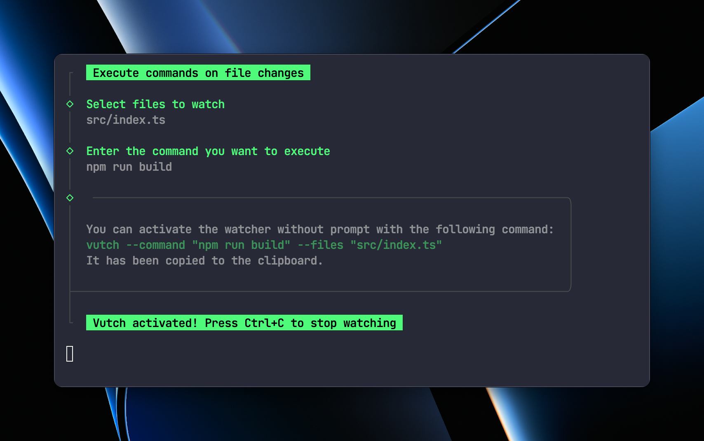

# vutch

Execute commands when files change. Either with a simple prompt in the CLI, or with two simple flags.



-   Run `vutch` to choose files and commands in a beautiful CLI.
-   Define files and command directly with the `--files` and `--command` flags.
-   Command is copied to the clipboard when using the prompt, allowing you to use it quickly again.

## Install

```bash
npm install vutch -g
```

## Usage

```bash
# run prompt
vutch

# run with flags
vutch --files=index.js,config.js  --command="npm_run_build"

# prompt with deeper directory
vutch --deep=3

# prompt without copying command to clipboard
vutch --skip-copy

# throw errors instead of logging them
vutch --throws
```

## Flags

-   `--files` - Comma separated list of files to watch.
-   `--command` - Command to execute when files change, use underscore instead of spaces.
-   `--deep` - How deep to go in the directory tree when using the prompt.
-   `--skip-copy` - Do not copy command to clipboard when using the prompt.
-   `--throws` - Throw errors instead of logging them on crasches.
